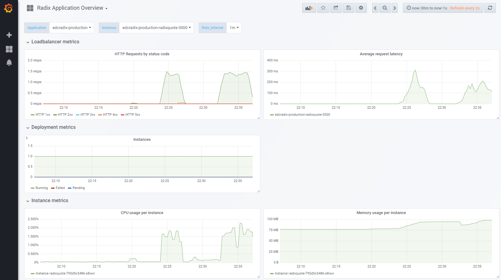
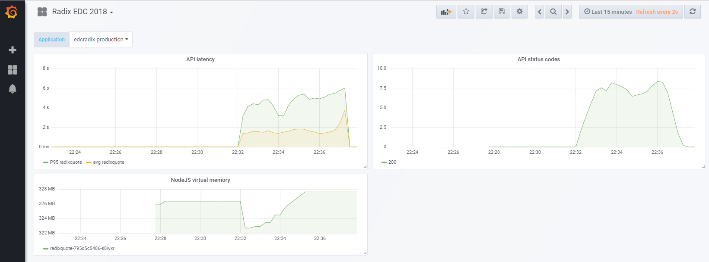

# Getting the feel of Radix

The vision/purpose for Omnia Radix is `Happy and efficient Software Developers.`

> We want to provide a basic modern cloud native software engineering capability for small teams. Keywords are iterative development, automation CI/CD and monitoring - all key elements of a DevOps platform.

In this workshop we will build a simple web app using a basic software development workflow (test, code, version control, build, test), move the app to Docker containers and eventually deploy the app to the Radix platform for deployment.

The Radix platform that we will use is very early alpha stage - so expect some manual hurdles. When finished you should have an idea about how a cloud native software development workflow could look like - and what role Radix could play for your team.

In the workshop, you can use any programming language that you want to as long as it’s able to run in a Docker container on a Linux architecture. Our example app will be written in Node.JS. If you prefer to follow this “track” - please make sure that Node.JS is 

## Pre-requisites

Your own precious developer laptop with the following installed and working

* `Development ecoystem` of your choice (Node, Python, C#...). The examples in the workshop will be using node.js.
* `docker`
* Having a active account on `github.com` and a working `ssh` regime with github.com
* `git` installed and working locally
* `ssh-keygen` installed and working

## Who is this workshop for?

Software developers & Coding Data Scientists.g You have at least one ecosystem that you know quite good. You know git. You have some knowledge of Web development (http) You have played around with Docker. You are searching for a good way to deploy your applications and webservices. You want to get started - or continue with - CI/CD, and want this to be as easy as possible. You have at least one cool sticker on your laptop!

# Workshop script

The sections below contains a highlight of the various steps in the workshop. Please note that the `master` branch of `this` project contains the `final` code and that the code for each of the parts are available in ´separate branches´ named after the part. 

If you want to follow the sequence of the workshop using a `Node.js´ ecosystem - follow the branches.

For you own project, you may want to use feature branches (for the various parts) and merge into master as we move along.

If you want to move ahead using you own pace - feel free to do so ... support may be limited :)

## Before start

* > Instructor will add your shortname to proper AD groups to allow access to the Radix environment
* > Have slack up and running, we'll communicate url's and stuff there


## Part 1 - Getting ready

> Objectives: Create a home for the project, prepare git and the development ecosystem and do a basic `hello world` app.

A few commands & tasks:
* mkdir
* git init
* Create a .gitignore
* npm init
* create a `src` directory
* create `index.js` in `src` echoing `hello world`
* run the application 
* add npm start to packet.json
* Add files to git `git add .`
* Commit files to git `git commit -m "your message"`

## Part 2 - Consuming famous quotes using api

> Objectives: Get famous quotes using api towards mashape.com

A few commands & tasks:
* Browse market.mashape.com, browse for api's, `create an account`, test a few api's from the browser (This is Kong api mgmt)
* Prepare your development environment to consume the famous quotes api
  * `npm install express --save`
  * `npm install request --save`
* Create code to get a famous quote and echo it to the console (std out)
  * Add code to `index.js` (example in branch `part2`). Example code will be available for quite a few languages on the market.mashape.com api hub.
  * Verify and test (use `npm start`)
* Move the API Key out from code to an environment variable
  * `export QUOTEKEY=<>`
  * Alter code to get API Key from environment
  * Verify and test (use `npm start`)
* Add files to git and commit. (Merge to master if you are using multiples branches)

## Part 3 - Create a web-services that echoes famous quotes

> Objectives: Echo quotes to a web browser using http

A few commands & tasks:
* Add webserver to code,
  * On a defined port (from environment variable)
  * Respond to requests on `/`
  * Get quote using api and respond the quote back to the requester
  * Add some basic error handling and port normalisation
  * Log progress, errors and other important information (to console, stdout)
* Example for `node.js` is available in the `part3´branch
* Add files to git and commit. (Merge to master if you are using multiples branches)

## Part 4 - Add tests to our code

> Objectives: Add tests to our code, run tests

A few commands & tasks (examples in the `part4` branch):
* Create a test directory and one or more tests to your code 
* Import a test framework and support components
  * Examples use https://mochajs.org/ and https://www.chaijs.com/
  * `npm install mocha --save-dev`
  * `npm install chai --save-dev`
* Create a test 
* Add running the tests to project.json	
* Run the tests with `npm test`
* Add files to git and commit. (Merge to master if you are using multiples branches)

## Part 5 - Dockerise the web service (app)

> Objectives: Create docker image of application. Use Docker to both build and test 

A few commands & tasks (examples in the `part5` branch):
* Create `Dockerfile` in root dir of project
  * We use multistage builds (https://docs.docker.com/develop/develop-images/multistage-build/)
  * Example: https://github.com/larskaare/edcradix/blob/part5/Dockerfile
* Docker should do testing and then build a neat and final image if tests are passed
* `docker build -t edcradix .` (substitute `edcradix` with you app name)
* `docker run -d -p 3000:3000 -e QUOTEKEY=<> edcradix` (add your api key)
* Experiment with different development workflows
  * Locally using `npm start` and `npm test` (all this can be fully automated for all changes)
  * Locally using Docker
  >Discuss opportunities (such as could the complete development environment be run in containers - little or no local installs?)
* Add files to git and commit. (Merge to master if you are using multiples branches)

## Part 6 - "Move" code to github.com

> Objectives: Create docker image of application. Use Docker to both build and test 

A few commands & tasks: (examples in the `part6` branch):
* Add README.md file. Add information about project and information on how to build, test++
* Add files to git and commit. (Merge to master if you are using multiples branches)
* Create a public repository on github.com to host your project
* Add remote to your local git project abd push to origin (github)
  * `git remote add origin <clone url` (get the clone url from github.com, use `ssh`)
  * `git push -u origin master` or `git push -u origin --all` if you have several branches
* Verify that project on github.com

## Part 7 - Deploy application to Omnia Radix

> Objectives: Define Radix config, define application in Radix, connect Radix application to code on github

A few commands & tasks: (examples in the `part7` branch):
* Create the file `radixconfig.yaml` in the local home dir of your project
* Define the projects Radix environment (start with one)
  * Example file: https://github.com/larskaare/edcradix/blob/part7/radixconfig.yaml
  * `yml` files and their parsers are known to be very picky and unforgiving 
* Do git add, commit and push to github.com (origin)
* Generate Radix deployment key
  * `Keep out of code repository!`
  * `ssh-keygen -t rsa -b 4096 -C "EDC Radix deploy key" -f ./edc_radix`
* Create application in Radix
  * Logon to console
  * Follow instructions in ´Create an app`
  * Create a `shared secret`. Keep it out of your code.
  * Make a note of the url to the Radix `webhook` (it is https)
* Connect Radix and your project on github.com
  * Add the deploy key to your github project on github (settings -> deploy keys)
  * Add the web hook to Radix to your github project on github (settings -> webhooks)
* Experiment
  * Add a small change locally
  * Do git add, commit and push
  * Watch the change being picked up by Radix, the build started and the finised
  * Examine logs
  * You may want to add the `secret` for the deploy key to make things work. Use the Radix web console to do this.

## Part 8 - Instrument and monitor application

> Objectives: Get to know the built-in metrics Radix gives you. Sneak peak on how to add custom instrumentation and dashboards.

> Right now we have to manually create the ServiceMonitor that tells Prometheus how to monitor an application. If using another application than what is already set up below, make sure to edit `monitoring/servicemonitor.yaml` and add it to the `default` namespace of the Kubernetes cluster.

For this we use the EDC Radix app in the production environment ( https://radixquote-edcradix-production.playground-v1-5-0.dev.radix.equinor.com )

1. Open relevant dashboards:
    - [Radix Application Overview](https://grafana.playground-v1-5-0.dev.radix.equinor.com/d/L-uZ0NAiz/radix-application-overview?refresh=2s&orgId=1&from=now-30m&to=now-1s&var-Namespace=edcradix-production&var-Upstream=edcradix-production-radixquote-3000&var-Rate_Interval=1m)
    - [Radix EDC 2018 Internals](https://grafana.playground-v1-5-0.dev.radix.equinor.com/d/8NKFEKAmk/radix-edc-2018?orgId=1&var-Namespace=edcradix-production)

2. Start load generator in background:
```
cd monitoring
docker run -i loadimpact/k6 run --vus 5 --duration 300s -< k6-test-script.js
```

3. Watch the graphs update!

If the live graphs for some reason should not work, here are two screenshots showing them in action:





### A few notes on the current version of Omnia Radix (Playground v1.5.0)

* Approaching early & limited beta
* The radixconfig.yaml on the master branch is the master
* All changes are buildt and all images are deployed to all environments (this will evolve)
* The build is currently not very fast
* Radix will also provide easy support for basic monitoring and metrics. Not in scope for this workshop.

